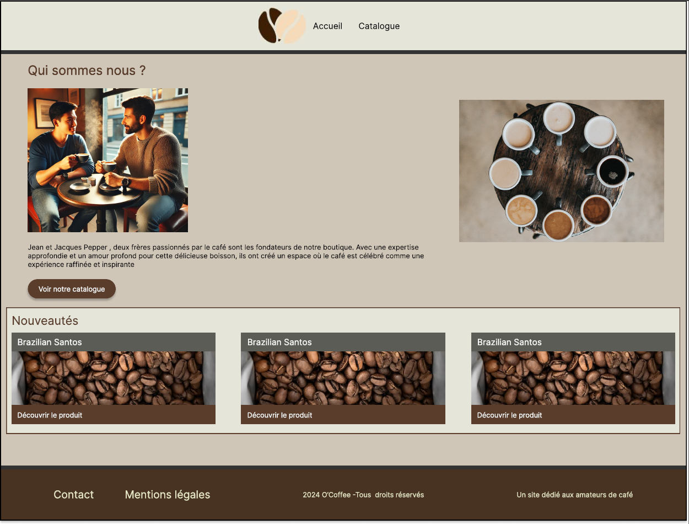

# O'Coffee

## Origine du projet

Ce projet est un exercice d'apprentissage. A l'orgine il a été proposé par l'école O'clock. Les consignes se trouvent dans le dossier ressources: [Le projet](./docs/demande-client/)

## Description du projet

oCoffee est un projet de refonte du site web d’une boutique de café. L’objectif est de dépasser le site vitrine actuel en ajoutant une navigation interactive dans un catalogue de produits, une présentation détaillée des cafés, ainsi qu’une carte de localisation de la boutique, le tout dans une nouvelle charte graphique. Ce projet utilise les technologies web comme HTML, CSS, JavaScript, Node.js, et EJS.

### Fonctionnalités principales :

- La page d’accueil présente l’histoire des fondateurs Jean et Jacques Pepper, deux frères passionnés de café, tout en proposant un accès direct au catalogue et une section dynamique affichant les cafés les plus récents.
.
- La page catalogue permet de filtrer les cafés par catégorie grâce à un formulaire, d’afficher dynamiquement chaque café avec ses informations essentielles, et de choisir d’en voir plus ou moins selon la quantité affichée.

- La page produit affiche les informations détaillées d’un café spécifique, incluant son nom, sa description, son origine, son prix, sa caractéristique principale et sa disponibilité.
- La page contact permet de localiser la boutique à l’aide d’une carte interactive générée par Leaflet.
- La page des mentions légales, accessible depuis le pied de page, fournit les informations légales du site.


## Objectifs du projet
- Élaborer les documents de conception en fonction de la demande utilisateur :  [Le projet](./docs/demande-client/)
- Concevoir et intégrer un site vitrine responsive.
- Développer une interface permettant d'afficher des contenus dynamiquement.
- Mettre en place une base de données pour gérer les informations du site.
- Implémenter une architecture MVC avec un moteur de rendu côté serveur.


## Installation

```
# Cloner le repertoire
git clone https://github.com/Sylvie-LD/ocoffee.git

# Naviguer dans le dossier
cd ocoffee

# Install dependencies
npm install

# Start the dev server
npm run dev
```

## Aperçu du site

